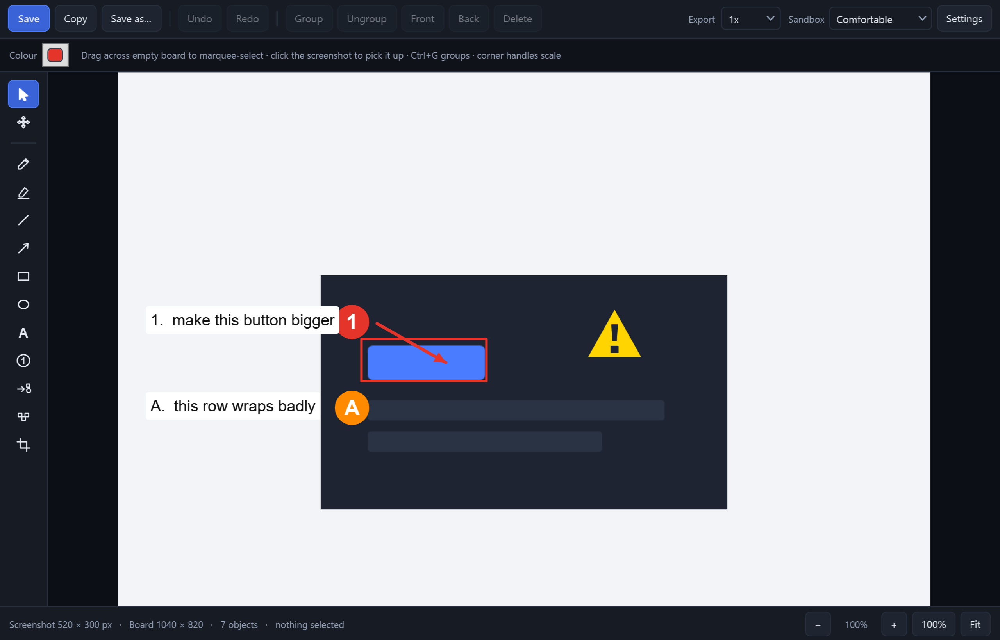
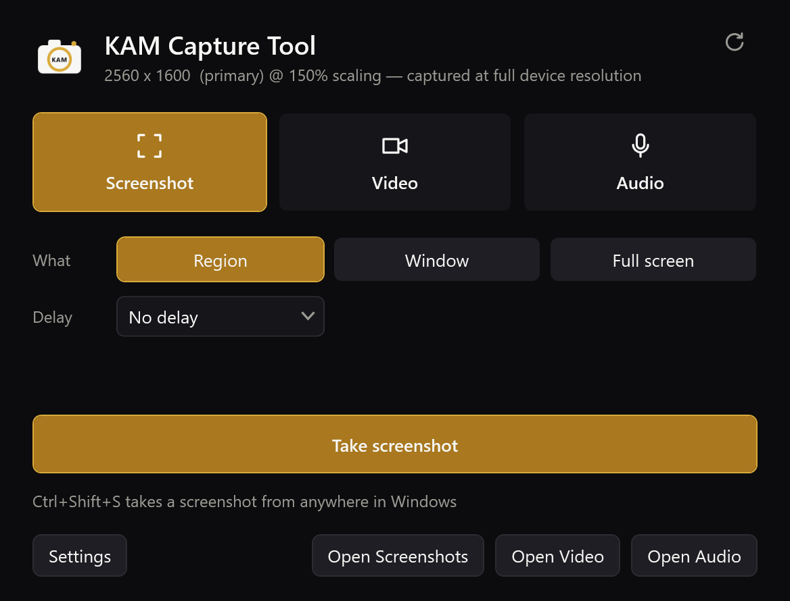
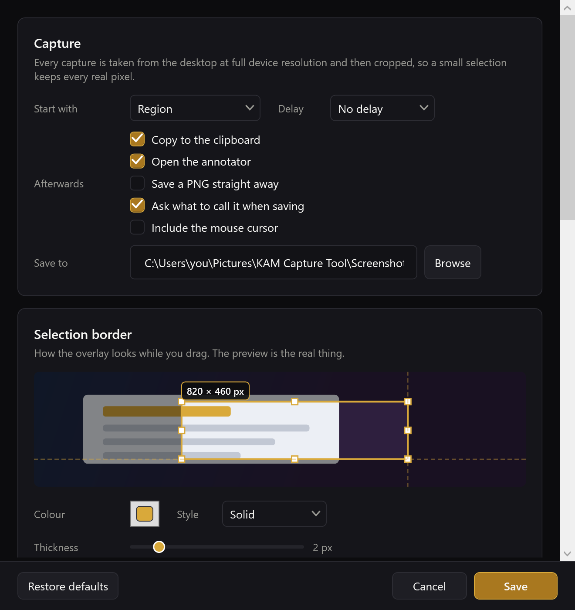
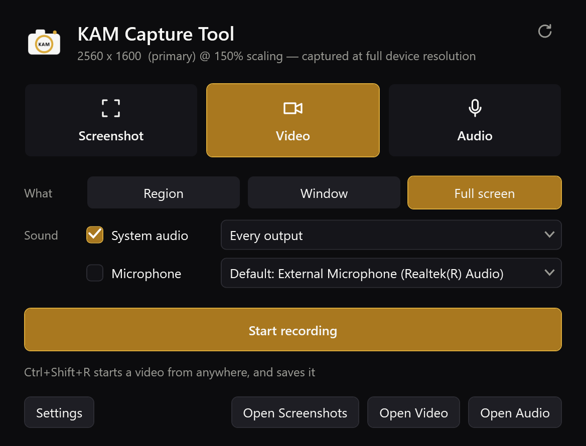
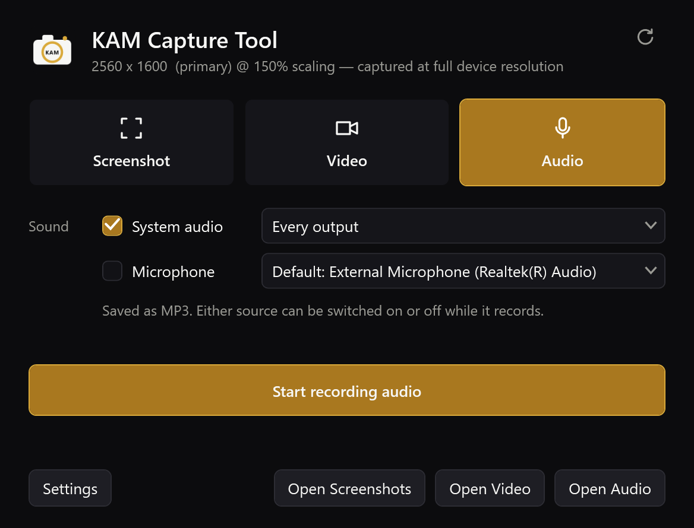
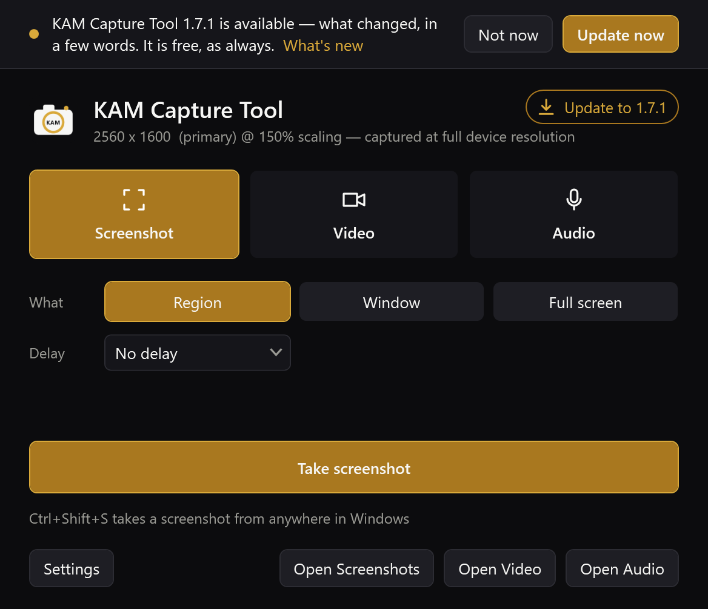

<p align="center">
  
</p>

<h1 align="center">KAM Capture Tool</h1>

<p align="center">
  A snipping tool that keeps every pixel it was given, and a place to write on
  the result without writing over it.
</p>

<p align="center">
  <a href="https://github.com/Ari-Joon/KAM-Capture-Tool/actions/workflows/ci.yml">
    
  </a>
  
  
  
  
</p>

---

Windows ships a snipping tool. It takes the picture and stops there, and the
picture it takes is smaller than the one on your screen.

KAM Capture Tool fixes both halves of that. It captures the desktop at its real
device resolution and crops out of that, so a small selection is as sharp as the
glass it came from. Then it drops the result onto a board that is larger than the
image, so there is somewhere to write that is not on top of the thing being
explained.

It exists for one workflow in particular: screenshot a piece of software, mark
the parts worth talking about **1**, **A**, **i**, and then say what should
happen to each of them. That is a faster and less ambiguous way to brief an
engineer — human or otherwise — than describing a layout in prose.

<p align="center">
  
</p>

<table>
  <tr>
    <td width="50%"></td>
    <td width="50%"></td>
  </tr>
  <tr>
    <td><b>Home</b> — three things it does: screenshot, video, audio. Pick one, say what, press the button.</td>
    <td><b>Settings</b> — the colour wheel drives a live rehearsal of the real overlay.</td>
  </tr>
</table>

## The pixels Windows throws away

This is the part that actually matters, and it is the reason a 64 × 64 crop
normally arrives looking like a photograph of a fax.

Windows hands each application a *logical* coordinate space and scales it to the
panel afterwards. On a 2560 × 1600 laptop at 150% scaling, applications are told
the desktop is 1707 × 1067. An application that captures in that space asks for
1707 × 1067 worth of pixels — and every one of the 2560 real ones is averaged
away before you ever see the image. Enlarging it later cannot bring them back,
because they were never in the file.

KAM Capture Tool declares itself per-monitor DPI aware, captures the whole
virtual desktop **once** at device resolution, and treats every selection as a
plain crop out of that buffer. Nothing is ever resampled.

What that is worth depends on your scaling, and it is just arithmetic:

| Display scaling | You drag a 200 × 100 box | Image you get | Pixels kept |
|---|---|---|---|
| 100% | 200 × 100 | 200 × 100 | 20,000 |
| 125% | 200 × 100 | **250 × 125** | 31,250 — 1.6x |
| 150% | 200 × 100 | **300 × 150** | 45,000 — 2.25x |
| 200% | 200 × 100 | **400 × 200** | 80,000 — 4x |

At 150%, which is the Windows default on most modern laptops, a small selection
carries **two and a quarter times** the detail it otherwise would. On a small
crop of a button or an error message, that is the difference between text you
can read and text you can only guess at.

Getting this right needed two things beyond the manifest entry. Window bounds
have to come from DWM's *extended frame bounds* rather than `GetWindowRect`,
which still includes the invisible resize border and leaves a transparent margin
around every window capture. And the overlay's own geometry has to come from
WPF's per-visual DPI rather than from `GetDpiForMonitor`, which on this hardware
reports 96 to a process the compositor is plainly rendering at 150%. Trusting it
drew the frozen desktop half again too large, so the selection overlay covered
two thirds of the screen — a bug that looks like a rendering glitch and is
actually a units mistake.

### Annotations are vectors, so 2x means sharper

The image is a bitmap and is never resampled. Everything drawn on top of it —
text, arrows, markers, symbols — is geometry, held as geometry until the moment
you export. Exporting at 2x or 3x re-renders all of it at that resolution rather
than enlarging a picture of it, so the writing gets genuinely sharper even though
the screenshot underneath cannot.

## The board is bigger than the image

A screenshot annotated in the usual way ends up with the explanation covering the
thing being explained.

Here the capture is placed on a board with room around it. Text goes in the
margin, arrows point from the margin into the image, and the image itself can be
picked up and moved around inside the board — it is clamped to the board, so it
can never be dragged somewhere it cannot be found. The board can be tightened or
widened at any time, the view zooms and pans, and the whole board is what gets
exported.

## Pointing at things

- **Numbered markers** — **1 2 3**, **A B C**, **i ii iii**, upper or lower. Each
  sequence counts on independently, so a numbered list and a lettered list can run
  side by side without colliding. Drop a marker, write "1. make this button
  bigger", and the reference is unambiguous.
- **Symbols** — one button drops down the whole table: block arrows in four
  directions plus diagonals, chevrons, circles, boxes, ticks, crosses, targets,
  callouts, brackets, braces, warnings, pins and pointers. Every one is a vector,
  scalable and rotatable, in any colour. One control, thirty glyphs — depth
  without a wall of buttons.
- **Pencil, highlighter, line, arrow, rectangle, ellipse** — the ordinary tools,
  with Shift to constrain.
- **Text** — Arial, any size. One font is a deliberate omission: choosing a
  typeface is not a decision worth making forty times a week, and a consistent
  one reads as a convention rather than as decoration.
- **Redaction** — a mosaic computed from the real pixels underneath, not a black
  box drawn over them, and not reversible from the exported file.

## Grouping

Anything drawn can be selected, dragged, and scaled by its corner handles.
Several objects can be bound into a group with `Ctrl+G` and from then on move and
scale as one — a circle, its arrow and its label stay together and stay in
proportion. Stroke weights and font sizes scale with the group rather than
staying behind at their original size, which is the part most tools get wrong.

## Recording

<table>
  <tr>
    <td width="50%"></td>
    <td width="50%"></td>
  </tr>
  <tr>
    <td><b>Video</b> — a region, a window or the full screen, with the sound you choose.</td>
    <td><b>Audio</b> — the same two sources, and no picture at all.</td>
  </tr>
</table>

A region you drag, a window you click, or the display under the pointer. H.264
to MP4 through ffmpeg, with the cursor optional. Region and window are picked on
the same overlay screenshots use, with **Start recording** where Copy and Save
would be; full screen starts straight away, because there is nothing left to
choose.

The audio is the interesting part. System audio and the microphone are captured
through WASAPI and mixed **in this process** into a single continuous 48 kHz
stream, which is what is handed to the encoder. The writer paces itself against
the wall clock and emits silence when nothing is playing, so the track never
stops. That is what makes it safe to switch microphone, mute the system audio, or
add a source you forgot, in the middle of a take: the output stream is unbroken,
so nothing drifts out of sync and nothing has to be re-recorded.

A five-second 640 × 360 take with system audio comes out as exactly 150 frames:
5.000 s of H.264 alongside 4.98 s of 48 kHz stereo AAC. Two things were needed to
get there. Both raw inputs are given `-thread_queue_size 4096 -analyzeduration 0
-probesize 32`, because with its defaults ffmpeg sits probing the audio pipe for
a stream description it has already been told, stops draining the video pipe
while it does, and the same five-second take arrives with **22 frames** in it.
And when capture cannot keep up, the frame pump repeats the last frame rather
than skipping: the encoder is being fed a constant frame rate, so a skipped frame
does not cost detail, it shortens the file and plays the recording back faster
than it happened.

The control bar carries the same switches as the home window, and sets
`WDA_EXCLUDEFROMCAPTURE` on itself, so it is invisible to every capture API on
the machine — including this recorder. It cannot film itself.

**Pause** leaves the paused stretch out of the file. The frame pump and the
audio mixer each stop their own clock while paused, so they pick up again
together: an eight-second take with two seconds paused in the middle comes out
as 181 frames, 6.03 s of video beside 6.01 s of audio.

### Sound on its own

Plenty of recordings do not need a picture. The one that prompted this is a
lecture given over slides: a screenshot of every slide, the call's sound
recorded underneath, and the two put together afterwards in an editor. The
slides are sharp because they are screenshots, and nobody has to store, upload
or download an hour of 4K video of something that changed forty times.

**Audio** records system audio, the microphone, or both, into one file. It is the
same in-process mixer the video uses, so it has the same property: either source
can be switched on or off from the recording bar in the middle of a take, and the
track carries on without a gap.

### System audio from every output

The first real lecture recorded with it came back wrong. Of fifteen takes, eight
held stretches of *digital* silence — every sample exactly zero, which no
microphone ever produces — starting the moment the microphone was muted. System
audio had contributed nothing.

System audio was recorded from one output: whichever Windows called the default
when the take began. A laptop has several — its speakers, its headphone jack, a
monitor's HDMI audio when one is plugged in — and a call or a video can play
through any of them. Plug headphones in part way through and the sound moves out
from under the recording. So it now records **every output at once**, checks
every two seconds for outputs that have appeared, and reopens any that stop.
Choosing one output is still there for anyone who wants only that one.

`--mixtest` plays a quiet tone from a separate program, the way a call would,
through each output in turn, and records it through the real recorder while each
microphone is switched on, off and on. Every output is heard at full level, and
the microphone changes nothing:

| Tone on | Microphone on | Off | On again |
|---|---|---|---|
| Speakers | 0.0201 | 0.0197 | 0.0199 |
| Headphones — the default | 0.0204 | 0.0200 | 0.0200 |
| Listening to the default alone, as before 1.7.0: Speakers | | 0.0014 | |

The last row is the old behaviour, for comparison: the same tone at 7% of its
level. How much leaks through depends on the hardware — this Realtek feeds its
speakers into its headphones' loopback a little; a monitor's HDMI output is a
separate device and feeds nothing.

The cause of those particular silent takes cannot be proven after the fact,
because nothing about audio was logged. Now it is: every take ends with a line
saying what each source heard and from which devices, and the recording bar has
a meter for system audio and another for the microphone, so a source that is
hearing nothing shows it before an hour has been recorded.

Each kind of output has a folder of its own, in the Windows library it belongs
to — `Pictures\KAM Capture Tool\Screenshots`, `Videos\KAM Capture Tool\Recordings`
and `Music\KAM Capture Tool\Audio` — and a button of its own on the home window:
**Open Screenshots**, **Open Video**, **Open Audio**.

| Format | An hour is | Trade-off |
|---|---|---|
| MP3, 192 kbps — the default | 86 MB | Opens in anything, and a take cut off by a crash is still playable up to the cut |
| M4A, AAC 128 kbps | 58 MB | Two thirds the size, but a take that is cut off before it is stopped cannot be opened |
| WAV, 48 kHz 16-bit | 691 MB | Uncompressed, for sound that is going to be worked on |

The sizes are arithmetic from the bit rates. Measured, an eight-second take
paused for two comes out at 6.14 s as MP3, 6.09 s as M4A and 6.12 s as WAV, all
48 kHz stereo. MP3 needs an ffmpeg built with LAME; the usual winget build has
it, and one that does not gets M4A instead, with a notice saying so.

## The tool never appears in its own output

Three different mechanisms, because there are three different problems.

For **the selection overlay**, the desktop is frozen *before* the overlay is
shown. The selection UI is drawn on top of a still image of the desktop, so it is
not merely hidden from the capture — it did not exist when the capture was taken.
It is also why dragging a selection is perfectly smooth: nothing underneath is
repainting.

For **the tool's own windows**, hiding them is not enough, and version 1.0 got
this wrong. Windows fades a hidden window out over several frames *after*
`Hide()` returns, and 1.0 waited a fixed 160 ms before reading the desktop. The
fade won that race often enough for the home window to turn up as a faint ghost
in real captures. Measured with `--ghosttest`, which hides a window and scores how
much of it survives into the grab:

| Strategy | Window left in the grab |
|---|---|
| Hide, wait 160 ms — what 1.0 did | **10–30%**, varying run to run |
| Hide, wait two presented frames, fade on | 100% |
| Exclude the window from capture | 0% |
| Hide with the fade switched off, wait two frames | 0% |

The spread in the first row is the point: it is a race, so the ghost comes and
goes, which is exactly why it read as an occasional glitch. Either of the last
two is enough on its own, and both are now applied, so if one
stops working on some future build of Windows the other still holds. The second
row is the instructive one: waiting for the compositor looks like the careful fix
and is worse than doing nothing, because two frames in, the fade has barely
started.

The first version of that test measured 0% for everything, including the broken
path — its window had no title bar, and Windows does not animate those. A test
that cannot fail is not evidence, so every check added since has been run once
against the bug it guards, to watch it fail, before being trusted to pass.

For **recording**, the control bar is excluded from capture at the compositor
level. The selection overlay only hides itself the same way *while a recording is
running*; the rest of the time it stays visible to other capture tools, because
making this application unphotographable would be an odd thing to do to someone
who wants to show you a bug in it.

## Naming as you save

A folder of `KAM-2026-09-24-10-15-22.png` files is a folder you will be renaming
later, one at a time, having opened each to remember what it was.

So screenshots, videos and audio all have **Save as…** — on the selection bar and
in the annotator (`F12`), and beside **Save** on the recording bar. Each kind
opens where its last Save as went, and when the last name ended in a number the
next one is already filled in: after *Lecture 5 slide 3* comes *Lecture 5 slide
4*, padding kept, stepping past any name already taken. Naming a deck of slides
is then mostly pressing Enter. A name the tool made up is not counted on, because
its last number is the seconds of a timestamp.

A recording is written under its automatic name while it runs, and Save as moves
the finished file. Cancel the dialog and it stays where it is: closing a dialog
never throws a recording away.

## Retakes

A bad take that gets saved is a file you find and delete later, usually after
listening to enough of it to be sure. Recording a lecture's worth of audio, that
adds up.

The recording bar reads **Pause · Retake · Save · Save as… · Stop**. Two ways to
keep a take, and two not to:

- **Retake** throws the take away and starts again straight away — same sources,
  same region or window, the bar where you left it, *take 2* beside the time.
- **Stop** ends everything without saving, and brings the home window back to
  the front.

**Save** is what used to be labelled Stop; it was renamed so that Stop could mean
stop. The annotator has **Retake** (`Ctrl+R`) for a screenshot: the capture is
thrown away and taken again the same way.

Neither asks "are you sure". A confirmation on every retake would slow down the
one thing retakes are for, so the safety is somewhere else: a thrown-away take
goes to the **Recycle Bin**, not away for good. The only question asked is in the
annotator, and only when something has been drawn on the capture, because that is
work rather than a file.

`--retaketest` drives the real controller: start an audio take, retake it,
stop the second, then check the folder is empty and both takes are in the
Recycle Bin — and take them back out, so the test leaves nothing behind. Run
once with the throw-away deleting outright, it failed: *expected both takes in
the Recycle Bin, found 0*.

## Nothing cut off

A window with a fixed size and text that changes will eventually be asked to
hold more than it has room for. `--layoutcheck` lays out every window offscreen
at its real size and at the smallest it can be resized to, in the states that
stretch it — each annotator tool, a recording running, a long status message,
an update waiting, a headset with a very long name — and fails if anything is
drawn outside the space it was given. Text that ends in an ellipsis on purpose
is listed, not failed.

Its first run found three things, all real:

| Where | What was cut off |
|---|---|
| The installer | The **Browse** button, pushed 15 px past the edge of the window |
| Settings, at its narrowest | Six controls — three Browse buttons, two shortcut boxes, a label — by 5 to 25 px |
| The annotator, at its shortest | The last four tools — marker, symbols, redact, crop — by up to 141 px |

The installer's folder box now takes whatever the button leaves, Settings can no
longer be made narrower than its rows, and the annotator no longer shorter than
its tool rail. The check needs no display, so it runs in CI.

## What this is not

- **Not a video editor.** It records and saves a file. Trimming, and putting
  slides under a sound track, belong elsewhere.
- **Not an uploader.** Nothing you capture is sent anywhere. There is no
  account and no telemetry; the one network request is the update check, and
  it can be switched off.
- **Not an OCR or "explain this screenshot" tool.** It hands you an image; what
  reads it is your business.
- **Not a screen-sharing tool.** It writes files.

## Design rules

1. A capture is never resampled. Crop, never scale.
2. The tool never appears in its own output.
3. One font. Fewer decisions per screenshot.
4. Depth behind one control, not clutter across many. Thirty symbols, one button.
5. Nothing you capture leaves the machine.

## Architecture

```
┌─ capture ────────────────────────────────────────────────┐
│  freeze the virtual desktop at device resolution (GDI)   │
│  per-monitor overlay, drawn on the frozen copy           │
└───────────────────────┬──────────────────────────────────┘
                        │  crop, in physical pixels
┌───────────────────────▼──────────────────────────────────┐
│  board — image layer + vector annotations + undo         │
│  render once for the screen, again at Nx for export      │
└───────────────────────┬──────────────────────────────────┘
                        │
┌───────────────────────▼──────────────────────────────────┐
│  recording — frames via DIB section, audio via WASAPI    │
│  mixed in-process, piped to ffmpeg; or the audio alone   │
└──────────────────────────────────────────────────────────┘
```

Everything is one self-contained executable. No runtime to install, no second
payload, no service, no driver, no elevation.

It is not compressed, which is why it is 170 MB. Compressed, it downloads at
72 MB — but then every library inside it is unpacked into memory as it loads
and stays there for as long as it runs, and this is a program that sits in the
tray all day:

| Packaging | Download | Start-up | Idle memory | Of which private |
|---|---|---|---|---|
| Compressed — up to 1.1.1 | 71.5 MB | 0.38 s | 261 MB | 161 MB |
| Uncompressed — from 1.1.2 | 170 MB | 0.50 s | **135 MB** | **87 MB** |

It starts a tenth of a second slower, and uses half the memory for as long as
it runs. Measured six seconds after start with nothing open, median of three
runs. Precompiling it as well (ReadyToRun) made start-up slower and memory
worse, because the .NET and WPF libraries it carries are precompiled already.

## Install

Download `KamCapture.exe` from
[Releases](https://github.com/Ari-Joon/KAM-Capture-Tool/releases) and run it.

It asks where to put itself, offers a desktop shortcut and a Start menu entry,
and installs per-user — so it never asks for an administrator. It is also
perfectly happy to be told *"just run it, don't install"* and stay wherever you
left it.

Running a newer download over an installed copy updates it where it is, and
starts from the choices you already made — which shortcuts you kept, and
whether it starts with Windows. If the old one is running in the tray, the
download offers the update and closes it for you once you say yes.

Uninstalling is in Add or Remove Programs, or:

```powershell
& "$env:LOCALAPPDATA\Programs\KAM Capture Tool\KamCapture.exe" --uninstall
```

Recording needs ffmpeg, which everything else does not:

```powershell
winget install Gyan.FFmpeg
```

### From source

```powershell
git clone https://github.com/Ari-Joon/KAM-Capture-Tool.git
cd "KAM-Capture-Tool"
./scripts/build.ps1
```

Needs the .NET 9 SDK. `build.ps1` regenerates the icon, runs the self-test,
publishes the single-file executable to `dist/`, and can install it with
`-Install`.

## Updates

<p align="center">
  
</p>

The circular arrow at the top right of the home window checks for a newer
version, and it checks by itself as well — once, a few seconds after starting,
and not again until the next start, so a program that sits in the tray all day
is not going back to the network all day. When there is one, the arrow becomes
a gold **Update to x.y.z**
button and a bar says what changed, with **What's new**, **Not now** and
**Update now**. If the window is closed, a tray notice says it once.

While it downloads, the button counts up — *Downloading 42%* — and clicking it
cancels. That is the only progress shown; an earlier version also put a bar
across the top saying the same thing, and on a small window it was cut off.

**Update now** downloads the new executable, checks it against the SHA-256
GitHub published for it, and hands over. The running copy closes, the new one
installs itself into the same folder with the same shortcuts and startup choice,
and opens again on the new version. **Not now** leaves that version alone until
a newer one lands; the button stays gold, so it is still one click away.

`scripts/test-update.ps1` runs the whole round trip between two local builds in
a sandbox. A download with the wrong checksum is refused and nothing changes; a
good one ends with the new version running where the old one was, and the old
one gone.

The check is one request to GitHub's releases API. It sends the tool's version
and nothing about you or your captures, and it can be switched off in Settings.

## Shortcuts

| | |
|---|---|
| `Ctrl+Shift+S` | Capture a region |
| `Ctrl+Shift+W` | Capture a window |
| `Ctrl+Shift+F` | Screenshot the full screen — the display the pointer is on |
| `Ctrl+Shift+R` | Record video, or save whatever is recording |

Inside the annotator: `V` select · `P` pencil · `K` highlighter · `L` line ·
`A` arrow · `R` rectangle · `O` ellipse · `T` text · `S` numbered marker ·
`D` symbols · `X` redact · `C` crop · `H` pan.
`Ctrl+N` new capture (this one stays open), `Ctrl+G` group, `Ctrl+Shift+G`
ungroup, `Ctrl+D` duplicate, wheel to zoom, space-drag to pan.

Full reference in [docs/SETUP.md](docs/SETUP.md).

## Status

Version 1.7.0. Everything described above is implemented and works.

| Area | State |
|---|---|
| Device-resolution capture and cropping | Done |
| Region, window and monitor modes, adjustable selection, magnifier | Done |
| Board, zoom, pan, movable image layer | Done |
| Text, pencil, highlighter, shapes, arrows, markers, redaction | Done |
| Symbol catalogue, 30 glyphs | Done |
| Select, drag, group, scale | Done |
| Export at 1x–4x, clipboard, PNG/JPG | Done |
| Video recording with live audio switching | Done |
| Audio-only recording to MP3, M4A or WAV, with the same live switching | Done |
| Pause that leaves the paused stretch out of the file | Done |
| A folder and an Open button for each kind of output | Done |
| Save as for screenshots, videos and audio, with the next name filled in | Done |
| Retake, and a Stop that saves nothing, into the Recycle Bin rather than away for good | Done |
| System audio from every output, followed as devices come and go, with a meter per source | Done |
| Layout check: nothing cut off, in any window, in CI | Done |
| Self-install, shortcuts, uninstall entry | Done |
| Updates from GitHub, with a prompt | Done |
| Global shortcuts, tray | Done |

The honest gaps:

- **Recording is CPU-side.** Frames are read back through a DIB section and piped
  to ffmpeg, which is fine at 1080p and gets expensive at 4K. Windows Graphics
  Capture with a GPU path would fix it and is not written yet.
- **Freeform lasso exists in the code but is not offered in the interface.** Three
  capture modes turned out to be the right number; a fourth was clutter.
- **The interactive editor has no automated tests.** Rendering, grouping and
  export are covered by `--selftest`, which runs in CI; mouse interaction is not.
- **The first lecture's silent takes are explained, not proven.** Every output is
  now recorded and every take logs what it heard, which covers each cause that
  could be found; the next lecture is the test of whether that was all of them.
- **Exclusive mode cannot be recorded.** A program that takes an output for
  itself, past the Windows mixer — some editors and players can — is inaudible
  to any recorder, this one included.
- **The layout check does not cover the capture overlay or the recording bar.**
  The overlay is drawn in code rather than laid out, and the bar sizes itself to
  whatever it holds, so neither has an edge to be cut off by in the same sense.
- **CI does not run the recording tests.** They need ffmpeg and a sound device,
  so `--rectest` and `--audiotest` are run on a real machine before a release
  rather than on every push.
- **The updater has only updated itself in a sandbox so far.** 1.2.0 is the
  first version that has one, so the first real update is the next release.
  Until then the evidence is `scripts/test-update.ps1`, which runs the whole
  thing — check, download, checksum, hand-over, restart — between two builds.
- **Unsigned.** SmartScreen will warn on first run until it has seen enough
  downloads, and an update is trusted only as far as the GitHub account that
  published it: the checksum proves the download is the file that was
  released, not who released it. Signing needs a certificate this does not
  have.

## Licence

Apache-2.0. See [LICENSE](LICENSE).
