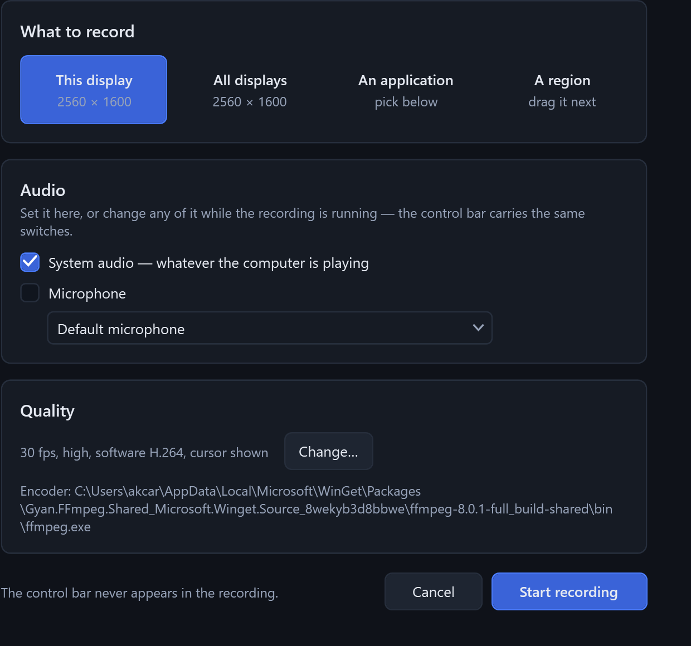

<p align="center">
  
</p>

<h1 align="center">KAM Capture Tool</h1>

<p align="center">
  A snipping tool that keeps every pixel it was given, and a place to write on
  the result without writing over it.
</p>

<p align="center">
  <a href="https://github.com/Ari-Joon/KAM-Capture-Tool/actions/workflows/ci.yml">
    
  </a>
  
  
  
  
</p>

---

Windows ships a snipping tool. It takes the picture and stops there, and the
picture it takes is smaller than the one on your screen.

KAM Capture Tool fixes both halves of that. It captures the desktop at its real
device resolution and crops out of that, so a small selection is as sharp as the
glass it came from. Then it drops the result onto a board that is larger than the
image, so there is somewhere to write that is not on top of the thing being
explained.

It exists for one workflow in particular: screenshot a piece of software, mark
the parts worth talking about **1**, **A**, **i**, and then say what should
happen to each of them. That is a faster and less ambiguous way to brief an
engineer — human or otherwise — than describing a layout in prose.

<p align="center">
  
</p>

<table>
  <tr>
    <td width="50%"></td>
    <td width="50%"></td>
  </tr>
  <tr>
    <td><b>Capture</b> — three modes, not fifteen. Region, window, monitor.</td>
    <td><b>Settings</b> — the colour wheel drives a live rehearsal of the real overlay.</td>
  </tr>
</table>

## The pixels Windows throws away

This is the part that actually matters, and it is the reason a 64 × 64 crop
normally arrives looking like a photograph of a fax.

Windows hands each application a *logical* coordinate space and scales it to the
panel afterwards. On a 2560 × 1600 laptop at 150% scaling, applications are told
the desktop is 1707 × 1067. An application that captures in that space asks for
1707 × 1067 worth of pixels — and every one of the 2560 real ones is averaged
away before you ever see the image. Enlarging it later cannot bring them back,
because they were never in the file.

KAM Capture Tool declares itself per-monitor DPI aware, captures the whole
virtual desktop **once** at device resolution, and treats every selection as a
plain crop out of that buffer. Nothing is ever resampled.

What that is worth depends on your scaling, and it is just arithmetic:

| Display scaling | You drag a 200 × 100 box | Image you get | Pixels kept |
|---|---|---|---|
| 100% | 200 × 100 | 200 × 100 | 20,000 |
| 125% | 200 × 100 | **250 × 125** | 31,250 — 1.6x |
| 150% | 200 × 100 | **300 × 150** | 45,000 — 2.25x |
| 200% | 200 × 100 | **400 × 200** | 80,000 — 4x |

At 150%, which is the Windows default on most modern laptops, a small selection
carries **two and a quarter times** the detail it otherwise would. On a small
crop of a button or an error message, that is the difference between text you
can read and text you can only guess at.

Getting this right needed two things beyond the manifest entry. Window bounds
have to come from DWM's *extended frame bounds* rather than `GetWindowRect`,
which still includes the invisible resize border and leaves a transparent margin
around every window capture. And the overlay's own geometry has to come from
WPF's per-visual DPI rather than from `GetDpiForMonitor`, which on this hardware
reports 96 to a process the compositor is plainly rendering at 150%. Trusting it
drew the frozen desktop half again too large, so the selection overlay covered
two thirds of the screen — a bug that looks like a rendering glitch and is
actually a units mistake.

### Annotations are vectors, so 2x means sharper

The image is a bitmap and is never resampled. Everything drawn on top of it —
text, arrows, markers, symbols — is geometry, held as geometry until the moment
you export. Exporting at 2x or 3x re-renders all of it at that resolution rather
than enlarging a picture of it, so the writing gets genuinely sharper even though
the screenshot underneath cannot.

## The board is bigger than the image

A screenshot annotated in the usual way ends up with the explanation covering the
thing being explained.

Here the capture is placed on a board with room around it. Text goes in the
margin, arrows point from the margin into the image, and the image itself can be
picked up and moved around inside the board — it is clamped to the board, so it
can never be dragged somewhere it cannot be found. The board can be tightened or
widened at any time, the view zooms and pans, and the whole board is what gets
exported.

## Pointing at things

- **Numbered markers** — **1 2 3**, **A B C**, **i ii iii**, upper or lower. Each
  sequence counts on independently, so a numbered list and a lettered list can run
  side by side without colliding. Drop a marker, write "1. make this button
  bigger", and the reference is unambiguous.
- **Symbols** — one button drops down the whole table: block arrows in four
  directions plus diagonals, chevrons, circles, boxes, ticks, crosses, targets,
  callouts, brackets, braces, warnings, pins and pointers. Every one is a vector,
  scalable and rotatable, in any colour. One control, thirty glyphs — depth
  without a wall of buttons.
- **Pencil, highlighter, line, arrow, rectangle, ellipse** — the ordinary tools,
  with Shift to constrain.
- **Text** — Arial, any size. One font is a deliberate omission: choosing a
  typeface is not a decision worth making forty times a week, and a consistent
  one reads as a convention rather than as decoration.
- **Redaction** — a mosaic computed from the real pixels underneath, not a black
  box drawn over them, and not reversible from the exported file.

## Grouping

Anything drawn can be selected, dragged, and scaled by its corner handles.
Several objects can be bound into a group with `Ctrl+G` and from then on move and
scale as one — a circle, its arrow and its label stay together and stay in
proportion. Stroke weights and font sizes scale with the group rather than
staying behind at their original size, which is the part most tools get wrong.

## Recording

<p align="center">
  
</p>

Full screen, one display, one application, or a region. H.264 to MP4 through
ffmpeg, with the cursor optional.

The audio is the interesting part. System audio and the microphone are captured
through WASAPI and mixed **in this process** into a single continuous 48 kHz
stream, which is what is handed to the encoder. The writer paces itself against
the wall clock and emits silence when nothing is playing, so the track never
stops. That is what makes it safe to switch microphone, mute the system audio, or
add a source you forgot, in the middle of a take: the output stream is unbroken,
so nothing drifts out of sync and nothing has to be re-recorded.

A five-second 640 × 360 take with system audio comes out as exactly 150 frames:
5.000 s of H.264 alongside 4.98 s of 48 kHz stereo AAC. Two things were needed to
get there. Both raw inputs are given `-thread_queue_size 4096 -analyzeduration 0
-probesize 32`, because with its defaults ffmpeg sits probing the audio pipe for
a stream description it has already been told, stops draining the video pipe
while it does, and the same five-second take arrives with **22 frames** in it.
And when capture cannot keep up, the frame pump repeats the last frame rather
than skipping: the encoder is being fed a constant frame rate, so a skipped frame
does not cost detail, it shortens the file and plays the recording back faster
than it happened.

The control bar carries the same switches as the setup screen, and sets
`WDA_EXCLUDEFROMCAPTURE` on itself, so it is invisible to every capture API on
the machine — including this recorder. It cannot film itself.

## The tool never appears in its own output

Three different mechanisms, because there are three different problems.

For **the selection overlay**, the desktop is frozen *before* the overlay is
shown. The selection UI is drawn on top of a still image of the desktop, so it is
not merely hidden from the capture — it did not exist when the capture was taken.
It is also why dragging a selection is perfectly smooth: nothing underneath is
repainting.

For **the tool's own windows**, hiding them is not enough, and version 1.0 got
this wrong. Windows fades a hidden window out over several frames *after*
`Hide()` returns, and 1.0 waited a fixed 160 ms before reading the desktop. The
fade won that race often enough for the home window to turn up as a faint ghost
in real captures. Measured with `--ghosttest`, which hides a window and scores how
much of it survives into the grab:

| Strategy | Window left in the grab |
|---|---|
| Hide, wait 160 ms — what 1.0 did | **10–30%**, varying run to run |
| Hide, wait two presented frames, fade on | 100% |
| Exclude the window from capture | 0% |
| Hide with the fade switched off, wait two frames | 0% |

The spread in the first row is the point: it is a race, so the ghost comes and
goes, which is exactly why it read as an occasional glitch. Either of the last
two is enough on its own, and both are now applied, so if one
stops working on some future build of Windows the other still holds. The second
row is the instructive one: waiting for the compositor looks like the careful fix
and is worse than doing nothing, because two frames in, the fade has barely
started.

The first version of that test measured 0% for everything, including the broken
path — its window had no title bar, and Windows does not animate those. A test
that cannot fail is not evidence, so every check added since has been run once
against the bug it guards, to watch it fail, before being trusted to pass.

For **recording**, the control bar is excluded from capture at the compositor
level. The selection overlay only hides itself the same way *while a recording is
running*; the rest of the time it stays visible to other capture tools, because
making this application unphotographable would be an odd thing to do to someone
who wants to show you a bug in it.

## What this is not

- **Not a video editor.** It records and saves a file. Trimming belongs
  elsewhere.
- **Not an uploader.** Nothing is sent anywhere. There is no account, no
  telemetry and no network code in this application at all.
- **Not an OCR or "explain this screenshot" tool.** It hands you an image; what
  reads it is your business.
- **Not a screen-sharing tool.** It writes files.

## Design rules

1. A capture is never resampled. Crop, never scale.
2. The tool never appears in its own output.
3. One font. Fewer decisions per screenshot.
4. Depth behind one control, not clutter across many. Thirty symbols, one button.
5. Nothing leaves the machine.

## Architecture

```
┌─ capture ────────────────────────────────────────────────┐
│  freeze the virtual desktop at device resolution (GDI)   │
│  per-monitor overlay, drawn on the frozen copy           │
└───────────────────────┬──────────────────────────────────┘
                        │  crop, in physical pixels
┌───────────────────────▼──────────────────────────────────┐
│  board — image layer + vector annotations + undo         │
│  render once for the screen, again at Nx for export      │
└───────────────────────┬──────────────────────────────────┘
                        │
┌───────────────────────▼──────────────────────────────────┐
│  recording — frames via DIB section, audio via WASAPI    │
│  mixed in-process, both piped to ffmpeg                  │
└──────────────────────────────────────────────────────────┘
```

Everything is one self-contained executable. No runtime to install, no second
payload, no service, no driver, no elevation.

## Install

Download `KamCapture.exe` from
[Releases](https://github.com/Ari-Joon/KAM-Capture-Tool/releases) and run it.

It asks where to put itself, offers a desktop shortcut and a Start menu entry,
and installs per-user — so it never asks for an administrator. It is also
perfectly happy to be told *"just run it, don't install"* and stay wherever you
left it.

Uninstalling is in Add or Remove Programs, or:

```powershell
& "$env:LOCALAPPDATA\Programs\KAM Capture Tool\KamCapture.exe" --uninstall
```

Recording needs ffmpeg, which everything else does not:

```powershell
winget install Gyan.FFmpeg
```

### From source

```powershell
git clone https://github.com/Ari-Joon/KAM-Capture-Tool.git
cd "KAM-Capture-Tool"
./scripts/build.ps1
```

Needs the .NET 9 SDK. `build.ps1` regenerates the icon, runs the self-test,
publishes the single-file executable to `dist/`, and can install it with
`-Install`.

## Shortcuts

| | |
|---|---|
| `Ctrl+Shift+S` | Capture a region |
| `Ctrl+Shift+W` | Capture a window |
| `Ctrl+Shift+F` | Capture everything |
| `Ctrl+Shift+R` | Start or stop recording |

Inside the annotator: `V` select · `P` pencil · `K` highlighter · `L` line ·
`A` arrow · `R` rectangle · `O` ellipse · `T` text · `S` numbered marker ·
`D` symbols · `X` redact · `C` crop · `H` pan.
`Ctrl+N` new capture (this one stays open), `Ctrl+G` group, `Ctrl+Shift+G`
ungroup, `Ctrl+D` duplicate, wheel to zoom, space-drag to pan.

Full reference in [docs/SETUP.md](docs/SETUP.md).

## Status

Version 1.1. Everything described above is implemented and works.

| Area | State |
|---|---|
| Device-resolution capture and cropping | Done |
| Region, window and monitor modes, adjustable selection, magnifier | Done |
| Board, zoom, pan, movable image layer | Done |
| Text, pencil, highlighter, shapes, arrows, markers, redaction | Done |
| Symbol catalogue, 30 glyphs | Done |
| Select, drag, group, scale | Done |
| Export at 1x–4x, clipboard, PNG/JPG | Done |
| Recording with live audio switching | Done |
| Self-install, shortcuts, uninstall entry | Done |
| Global shortcuts, tray | Done |

The honest gaps:

- **Recording is CPU-side.** Frames are read back through a DIB section and piped
  to ffmpeg, which is fine at 1080p and gets expensive at 4K. Windows Graphics
  Capture with a GPU path would fix it and is not written yet.
- **Freeform lasso exists in the code but is not offered in the interface.** Three
  capture modes turned out to be the right number; a fourth was clutter.
- **The interactive editor has no automated tests.** Rendering, grouping and
  export are covered by `--selftest`, which runs in CI; mouse interaction is not.
- **The live recording controls have not been used in anger.** The pipeline is
  measured — `--rectest` writes exactly `fps × seconds` frames beside a
  continuous audio track — but switching microphone mid-take and stopping from
  the shortcut have only been reasoned about, not exercised end to end.
- **Unsigned.** SmartScreen will warn on first run until it has seen enough
  downloads. Signing needs a certificate this does not have.

## Licence

Apache-2.0. See [LICENSE](LICENSE).
